# Terraform Infrastructure Setup

This project aims to automate the creation and management of AWS infrastructure using Terraform.

🔹 In this project, I used various Terraform features such as:

 - Conditional expression , Variables , Built-in functions , Remote backend , Dynamic blocks, Provisioners , depends_on, datasource

---------
The setup includes creating a Virtual Private Cloud (VPC), subnets, route tables, security groups, EC2 instances, deploy web app, a target group, and an application load balancer. 

It also configures a remote backend for storing Terraform state files using S3 and DynamoDB.

## Final Result

<div align="center">
    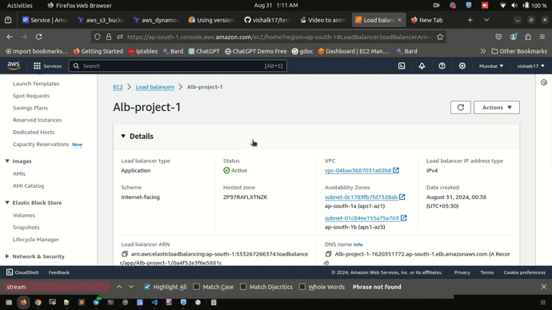
</div>

## Prerequisites

Ensure that you have AWS CLI and Terraform installed on your system.

## 1. Configure AWS Credentials

Before setting up the remote backend or infrastructure, configure your AWS CLI with appropriate access keys. Run the following command and provide the required information:

```bash
aws configure
```

## 2. Setup S3 and DynamoDB for Remote Backend

Navigate to the `setup_s3_dynamodb_backend` directory and initialize and apply the Terraform configuration to create the S3 bucket and DynamoDB table for remote backend state management.

```bash
cd setup_s3_dynamodb_backend
terraform init
terraform apply
```

### Result

- **S3 Bucket Created:**

  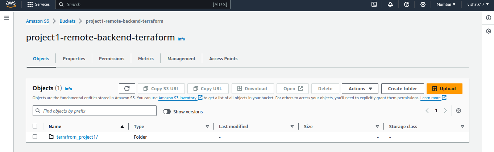

- **DynamoDB Table Created:**

  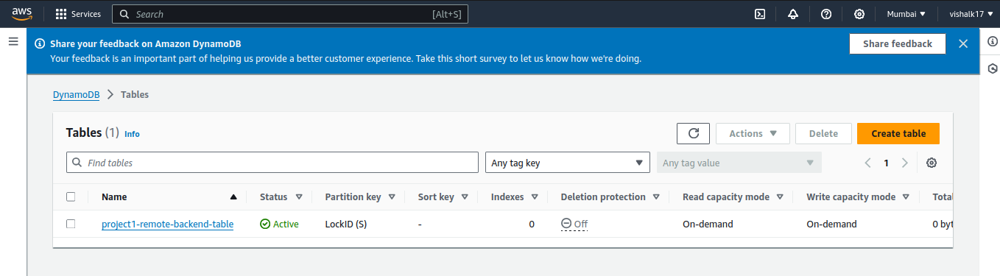

## 3. Setup SSH Keys for Instances

Ensure you have SSH keys set up to access your EC2 instances. 

Navigate to `setup_Infra/keys/Readme.md` for detailed instructions on how to generate SSH keys for your instances.


## 4. Setup Infrastructure

Navigate to the `setup_Infra` directory and initialize and apply the Terraform configuration to set up the AWS infrastructure, including VPC, subnets, route tables, security groups, instances, target groups, and an application load balancer.

```bash
cd setup_Infra
terraform init
terraform apply -var-file=prod.tfvars
```

### Result

- **State File in S3 Bucket (Remote Backend):**

  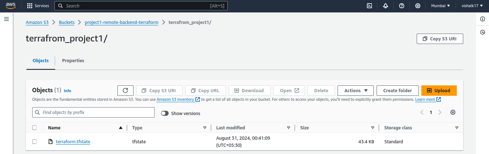

- **VPC:**

  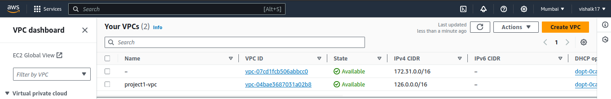

- **Subnets:**

  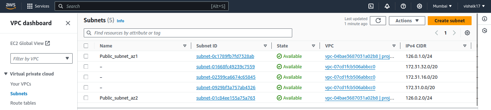

- **Routing Tables:**

  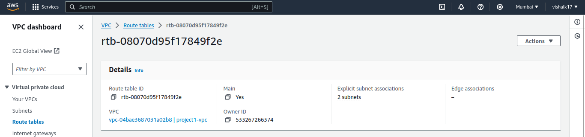

- **Security Group:**

  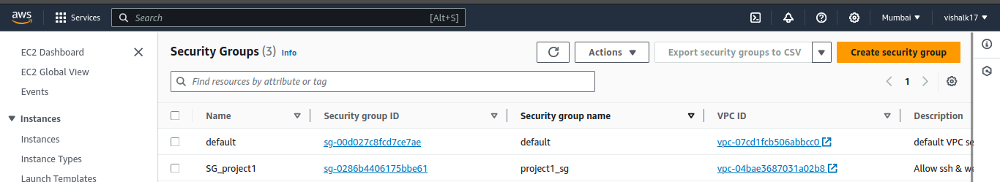

- **Instances:**

  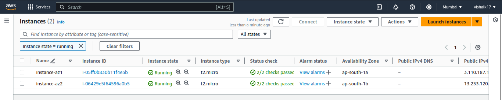

- **Target Group:**

  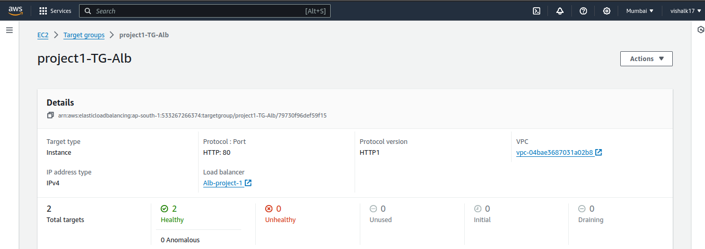

- **Application Load Balancer:**

  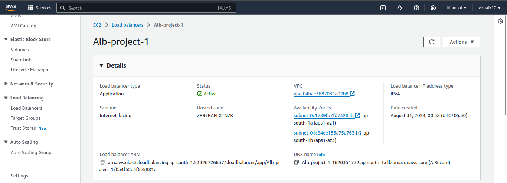
